# VQ

## Table of Contents

1. [Phase 1: VQGAN Inference and Evaluation](#phase-1-vqgan-inference-and-evaluation)
   - [Objective](#objective)
   - [Experimental Setup](#experimental-setup)
   - [Results](#results)
   - [Analysis](#analysis)
   - [Next Steps](#next-steps)

## Phase 1: VQGAN Inference and Evaluation

### Objective
- Understand the VQGAN inference path
- Run reconstructions on ImageNet
- Evaluate with IS, FID, sFID, LPIPS, PSNR, SSIM

### Experimental Setup

#### Environment
- **Hardware**: Single GPU - RTX 1080 Ti; container RAM ~28 GB
- **Python Stack**: `numpy==1.19.5`, `scipy==1.9.3`, `pillow==9.0.0`, `scikit-image==0.18.3`, `torchvision==0.14.1+cu117`
- **Model**: `VQModel` loaded from `CONFIG_PATH` and `MODEL_PATH`

#### Data
- **Dataset**: ImageNet `val` at `/datasets/imagenet/val` (50,000 images in 1,000 classes)

#### Pipeline Summary
- Encode–decode per image or batch
- Convert back to `[0,1]` and `uint8` for metrics
- Metrics: LPIPS (VGG), PSNR, SSIM, FID, IS,

### Results

#### Metrics Comparison

| Run | IS | rFID | sFID | LPIPS | PSNR | SSIM | Notes |
|---|---:|---:|---:|---:|---:|---:|---|
| VQGAN (paper, f=16, 16,384) | — | 4.98 | — | 0.38 ± 0.07 | — | — | NLL 2.32 × 10^3; "reconstruction error" terminology used in paper (not LPIPS); see footnote for IS sampling variants |
| Our experiment | 46.76 | 7.53 | 5.59 | 0.286 | 19.65 | 0.486 | Precision 0.70442; Recall 0.6451; metrics via OpenAI evaluator |
| Our experiment (Dec 9, corrected reference) | 46.76 | 5.06 | — | 0.286 | 19.65 | 0.486 | Recall 0.97268; compared against ImageNet val ground-truth NPZ |

#### Sample Reconstructions (Original VS Reconstructed)

  
  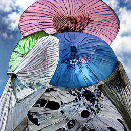
  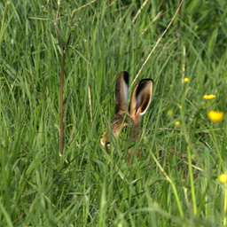
  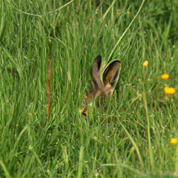
   
  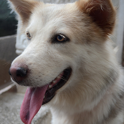
  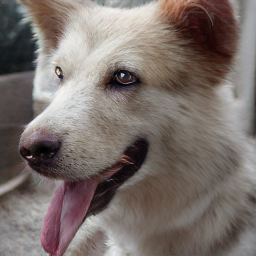
  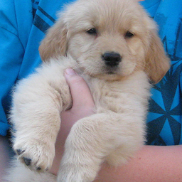
  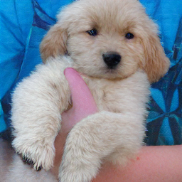

### Analysis

#### Notes
- Black images were caused by float16 instability during export; resolved by disabling `autocast`
- Recon tensors occasionally exceed `[-1,1]`, but clamping prior to `uint8` normalization keeps images valid
- Audit shows the decoder output is not strictly bounded to [-1, 1] , with rare transients reaching [-2.92, 2.75] . However, these affect <1.1% of pixels and result in negligible clamping error.
- The VQGAN decoder exhibits a systematic intensity shift across color channels. Audit of the reconstruction tensors ( N=50,000 ) reveals the following mean intensity values (expected mean is 0.0 for [-1, 1] normalized data):
  - Red Channel : $\mu \approx -0.05$
  - Green Channel : $\mu \approx -0.10$
  - Blue Channel : $\mu \approx -0.20$
  The Blue channel is systematically "under-driven" (suppressed) compared to Red and Green channels(the Real ImageNet distribution is centered near $\mu=0$), This bias might artificially inflates the FID score.
- sFID (from openai-evaluator) confirms spatial structure is preserved; FID is consistent with photorealistic reconstructions(As of 27th Nov 2025, we could not reproduce reported numbers)
- Dec 9: Previous FID used `VIRTUAL_imagenet256_labeled.npz` (training-set statistics). Updated evaluation compares reconstructions against ImageNet validation ground truth (`imagenet_val_gt_256.npz`), yielding rFID 5.06 and higher recall. Which alignes with reported numbers

#### Metrics Interpretation
- **Evaluation computed on exported reconstructions**
- **Metrics**: Lower is better except IS
- **sFID**: Uses spatial Inception features and is more sensitive to structural/layout errors than standard FID

### Next Steps

#### Codebook Perturbation
**Goal**: Test robustness and semantics of the learned visual vocabulary

**Methods**:
- Zero-out random codes (10–50%)
- Permute indices before decode
- Swap a code with its nearest neighbors

**Procedure**:
- Re-decode with the perturbed codebook
- Save a small grid
- Measure IS/FID/sFID deltas relative to baseline

**Expected Signals**:
- Collapse under heavy ablation ⇒ redundancy low
- Minor FID change ⇒ redundancy/high overlap
- Spatial artifacts under shuffles ⇒ strong code–structure coupling

#### Codebook Quality Assessment
**Goal**: Quantify how effectively the 16,384-codebook is used

**Metrics**:
- Usage histogram across val set
- Perplexity \(exp(H)\) where \(H\) is entropy of code freq
- Count of dead codes (never used)

**Procedure**:
- Encode ImageNet val
- Collect discrete indices
- Aggregate per-code counts
- Report top-100 most/least used codes

**Interpretation**:
- Low perplexity or many dead codes ⇒ capacity underused
- Uniform usage with few dead codes ⇒ healthy codebook

#### Evaluation Framework
- **Standardized Evaluation**: Ensure comparable metrics with `torch-fidelity`
- **Enhanced Metrics**: Consider additional evaluation protocols for comprehensive assessment

### Useful Links
- [Illustrated VQGAN-CLIP Guide](https://ljvmiranda921.github.io/notebook/2021/08/08/clip-vqgan/) – visual walk-through of VQGAN and CLIP interaction

## Phase 2: LlamaGen

### Objective
- Replicate single-GPU reconstruction for LlamaGen VQ-VAE (VQ-8 / VQ-16)
- Eevaluate rFID, IS, Precision/Recall
- Validate results against paper-reported numbers and confirm correct reference usage

### Experimental Setup

#### Environment
- **Hardware**: Single GPU server
- **Python Stack (reconstruction)**: `torch>=2.1`, `torchvision`, `numpy`, `Pillow`, `scikit-image`
- **Script**: `LlamaGen/scripts/reconstruct_imagenet.py`

#### Model
- **Tokenizer**: `VQ-8` or `VQ-16`
- **Checkpoint**: `vq_ds8_c2i.pt` (VQ-8), `vq_ds16_c2i.pt` (VQ-16)
- **Codebook**: size `16384`, embed dim `8`

### Data
- **Dataset**: ImageNet `val` at `/datasets/imagenet/val` (50,000 images)
- **Reference (ground truth)**: `imagenet_val_gt_256.npz` created from validation images (center-cropped to 256)
- Note: Using `VIRTUAL_imagenet256_labeled.npz` (training-set stats) overestimates reconstruction FID; use val ground truth for rFID.

### Pipeline Summary
- Center crop with `center_crop_arr` to `256×256`
- Normalize to `[-1, 1]` via `transforms.Normalize(mean=[0.5]*3, std=[0.5]*3)`
- DataLoader with batching (`BATCH_SIZE`, `NUM_WORKERS`, pinned memory)
- Encode to latent and indices: `vq_model.encode(x)`; reconstruct via `vq_model.decode_code(indices, latent.shape)`
- Optional resize for evaluation size; LPIPS computed on GPU
- Convert reconstructed tensors to `[0, 255]` `uint8`; save PNGs and build `.npz` (`arr_0`)
- Evaluate with OpenAI evaluator comparing `reconstructions.npz` vs `imagenet_val_gt_256.npz`

### Results

#### Metrics Comparison

| Run | IS | rFID | sFID | LPIPS | PSNR | SSIM | Notes |
|---|---:|---:|---:|---:|---:|---:|---|
| LlamaGen VQ-16 (Paper, 256x256) | — | 2.19 | — | — | 20.79 | 0.675 | Usage 97.0% |
| LlamaGen VQ-16 (Dec 10, reconstruction on ImageNet val) | 52.70 | 2.19 | 5.00 | 0.2281 | 20.79 | 0.5580 | Precision 0.97766; Recall 0.9951;  |
| LlamaGen VQ-8 (Dec 9, reconstruction on ImageNet val) | 59.02 | 0.5905 | 2.5488 | 0.1232 | 24.455 | 0.735212 | Precision 0.99928; Recall 0.99988;|
| LlamaGen VQ-8 (Paper, 256x256) | — | 0.59 | — | — | 24.45 | 0.813 | Usage 97.6% |

#### Sample Generations (LlamaGen VQ-8)
From the VQ-8 model

  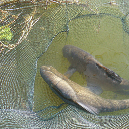
  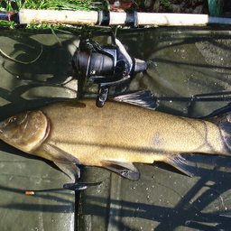
  
  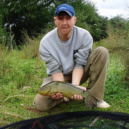
   
  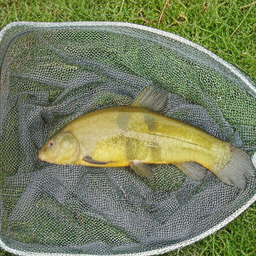
  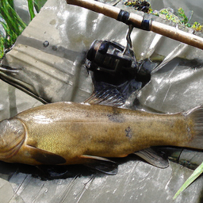
  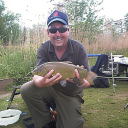
  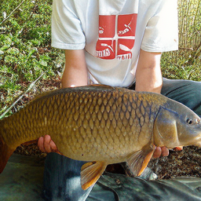

## Citations

- Esser, Rombach, Ommer. "Taming Transformers for High-Resolution Image Synthesis." arXiv:2012.09841. https://arxiv.org/abs/2012.09841
- OpenAI Guided Diffusion Evaluations (used for metrics computation): https://github.com/openai/guided-diffusion/tree/main/evaluations
- LlamaGen (repo): https://github.com/FoundationVision/LlamaGen
- LlamaGen (paper): https://arxiv.org/abs/2406.06525
